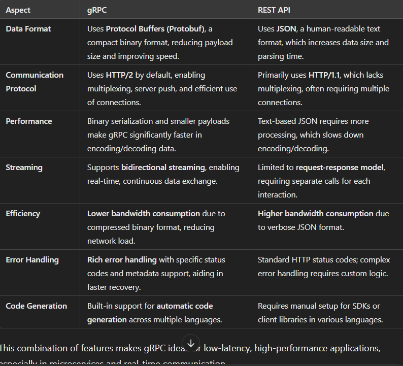

## 1. What is a Docker volume?

**Answer:** (a) A directory on the host machine that is mounted into a container.  
**Explanation:** Docker volumes are directories on the host machine that are mounted into containers, allowing containers to persist data between runs, share data, and isolate data.

## 2. How do you connect to a running Docker container?

**Answer:** (b) Use the docker exec command.  
**Explanation:** `docker exec` allows you to run commands inside a running container, effectively connecting to it. `docker attach` connects to the container’s main process but is generally less flexible.

## 3. Which of the following networks are ideal when containers operating on various Docker hosts need to connect?

**Answer:** (c) Overlay.  
**Explanation:** Overlay networks enable communication between containers across multiple Docker hosts, making them ideal for distributed applications and multi-host communication.

## 4.  Which of the following architecture does Docker use?

**Answer:** (a) Client - Server.  
**Explanation:** Docker operates on a client-server model where the Docker client communicates with the Docker daemon, which performs container operations.


## 5. Compare and contrast shutdown() with close() for terminating a connection.

**Answer:**  
`close()` terminates the connection by releasing resources associated with the socket. However, this abrupt closure may leave the other side unaware of termination, potentially causing data loss if data was still being sent or received.  
`shutdown()` can partially or fully shut down communication. It allows fine-grained control (e.g., you can specify whether to stop receiving, sending, or both) and informs the peer that communication is ending, ensuring a cleaner shutdown process.

## 6. How does the TIME_WAIT state allow old duplicate segments to expire in the network for ensuring reliable communication?

**Answer:**  
The TIME_WAIT state in TCP occurs after a connection is closed, ensuring that any delayed packets do not interfere with new connections. This delay allows old duplicate segments to expire, avoiding issues like data being mistakenly delivered to a new connection. TIME_WAIT also enables proper acknowledgment of the final segments to confirm both sides have fully closed.

## 7. Evaluate byte ordering functions htons, htonl, ntohs, and ntohl. Write practical uses for data conversion between different byte orders.

**Answer:**  
**Functions:**  
- `htons` (Host TO Network Short) and `htonl` (Host TO Network Long) convert values from host to network byte order.  
- `ntohs` (Network TO Host Short) and `ntohl` (Network TO Host Long) convert values from network to host byte order.  

**Use:**  
These conversions ensure that systems with different endianness (byte order) can correctly interpret data. For example, a server in Big Endian might use these functions to interpret incoming data from a Little Endian client, ensuring data compatibility in network communication.

# 8. Analyze why gRPC is faster than REST APIs.

**Answer:**  
gRPC often outperforms REST for several reasons:  
- **Binary Data Transmission:** gRPC uses Protocol Buffers (Protobuf), a compact binary format, which is faster and smaller than JSON (used in REST).  
- **HTTP/2 Support:** gRPC leverages HTTP/2, enabling multiplexing (multiple requests over a single connection), reducing latency and improving throughput.  
- **Bidirectional Streaming:** gRPC supports streaming requests and responses, making it ideal for real-time communication.  
- **Less Overhead:** REST’s text-based JSON format and statelessness often introduce additional overhead, whereas gRPC is optimized for speed with smaller data packets.



# <center>Q-2 </center>

## Part (A): Setting SO_LINGER and SO_BROADCAST Options

```c
#include <stdio.h>
#include <stdlib.h>
#include <string.h>
#include <arpa/inet.h>
#include <sys/socket.h>
#include <unistd.h>
#include <netinet/in.h>

#define PORT 8080
#define BROADCAST_IP "255.255.255.255"
#define BUFFER_SIZE 1024

int main() {
    int sockfd;
    struct sockaddr_in server_addr;
    int optval = 1;

    // Create socket
    sockfd = socket(AF_INET, SOCK_DGRAM, 0);
    if (sockfd == -1) {
        perror("Socket creation failed");
        exit(EXIT_FAILURE);
    }

    // Set SO_LINGER
    struct linger ling;
    ling.l_onoff = 1;  // Enable linger
    ling.l_linger = 5; // Linger time in seconds
    if (setsockopt(sockfd, SOL_SOCKET, SO_LINGER, &ling, sizeof(ling)) == -1) {
        perror("Failed to set SO_LINGER");
        close(sockfd);
        exit(EXIT_FAILURE);
    }

    // Set SO_BROADCAST
    if (setsockopt(sockfd, SOL_SOCKET, SO_BROADCAST, &optval, sizeof(optval)) == -1) {
        perror("Failed to set SO_BROADCAST");
        close(sockfd);
        exit(EXIT_FAILURE);
    }

    // Set buffer sizes
    int send_buff_size = 8192;
    int recv_buff_size = 8192;
    setsockopt(sockfd, SOL_SOCKET, SO_SNDBUF, &send_buff_size, sizeof(send_buff_size));
    setsockopt(sockfd, SOL_SOCKET, SO_RCVBUF, &recv_buff_size, sizeof(recv_buff_size));

    // Broadcast a message
    memset(&server_addr, 0, sizeof(server_addr));
    server_addr.sin_family = AF_INET;
    server_addr.sin_port = htons(PORT);
    inet_pton(AF_INET, BROADCAST_IP, &server_addr.sin_addr);

    char *message = "Broadcast message from server";
    if (sendto(sockfd, message, strlen(message), 0, (struct sockaddr *)&server_addr, sizeof(server_addr)) == -1) {
        perror("Failed to broadcast message");
        close(sockfd);
        exit(EXIT_FAILURE);
    }

    printf("Broadcast message sent successfully\n");

    // Close socket
    close(sockfd);
    return 0;
}
```

Part (B): TCP Client-Server with Application-level Acknowledgement

```c
#include <stdio.h>
#include <stdlib.h>
#include <string.h>
#include <unistd.h>
#include <arpa/inet.h>

#define PORT 8080
#define BUFFER_SIZE 1024

int main() {
    int server_fd, client_fd;
    struct sockaddr_in server_addr, client_addr;
    socklen_t addr_len = sizeof(client_addr);
    char buffer[BUFFER_SIZE] = {0};
    
    server_fd = socket(AF_INET, SOCK_STREAM, 0);
    if (server_fd == -1) {
        perror("Socket creation failed");
        exit(EXIT_FAILURE);
    }

    server_addr.sin_family = AF_INET;
    server_addr.sin_addr.s_addr = INADDR_ANY;
    server_addr.sin_port = htons(PORT);

    if (bind(server_fd, (struct sockaddr *)&server_addr, sizeof(server_addr)) == -1) {
        perror("Bind failed");
        close(server_fd);
        exit(EXIT_FAILURE);
    }

    if (listen(server_fd, 5) == -1) {
        perror("Listen failed");
        close(server_fd);
        exit(EXIT_FAILURE);
    }

    printf("Server listening on port %d...\n", PORT);

    client_fd = accept(server_fd, (struct sockaddr *)&client_addr, &addr_len);
    if (client_fd == -1) {
        perror("Accept failed");
        close(server_fd);
        exit(EXIT_FAILURE);
    }

    read(client_fd, buffer, BUFFER_SIZE);
    printf("Message received from client: %s\n", buffer);
    
    char *ack_msg = "Acknowledgement: Data received";
    write(client_fd, ack_msg, strlen(ack_msg));
    
    // Shutdown socket communication to signal end of transmission
    shutdown(client_fd, SHUT_RDWR);
    close(client_fd);
    close(server_fd);
    return 0;
}
```

## Part (C): UDP Client-Server Application to Calculate Area of Rectangle

### `server.c`

```c
#include <stdio.h>
#include <stdlib.h>
#include <string.h>
#include <arpa/inet.h>
#include <unistd.h>

#define PORT 8080
#define BUFFER_SIZE 1024

int main() {
    int sockfd;
    struct sockaddr_in server_addr, client_addr;
    socklen_t addr_len = sizeof(client_addr);
    char buffer[BUFFER_SIZE];
    
    sockfd = socket(AF_INET, SOCK_DGRAM, 0);
    if (sockfd == -1) {
        perror("Socket creation failed");
        exit(EXIT_FAILURE);
    }

    server_addr.sin_family = AF_INET;
    server_addr.sin_addr.s_addr = INADDR_ANY;
    server_addr.sin_port = htons(PORT);

    if (bind(sockfd, (struct sockaddr *)&server_addr, sizeof(server_addr)) == -1) {
        perror("Bind failed");
        close(sockfd);
        exit(EXIT_FAILURE);
    }

    printf("Server listening on port %d...\n", PORT);

    while (1) {
        recvfrom(sockfd, buffer, BUFFER_SIZE, 0, (struct sockaddr *)&client_addr, &addr_len);
        int length, width;
        sscanf(buffer, "%d %d", &length, &width);
        int area = length * width;
        printf("Received request from client IP: %s, Port: %d\n", inet_ntoa(client_addr.sin_addr), ntohs(client_addr.sin_port));
        
        snprintf(buffer, BUFFER_SIZE, "Area of rectangle: %d", area);
        sendto(sockfd, buffer, strlen(buffer), 0, (struct sockaddr *)&client_addr, addr_len);
    }
    
    close(sockfd);
    return 0;
}
```
### `client.c`

```c
#include <stdio.h>
#include <stdlib.h>
#include <string.h>
#include <arpa/inet.h>
#include <unistd.h>

#define PORT 8080
#define BUFFER_SIZE 1024

int main() {
    int sockfd;
    struct sockaddr_in server_addr;
    socklen_t addr_len = sizeof(server_addr);
    char buffer[BUFFER_SIZE];
    
    sockfd = socket(AF_INET, SOCK_DGRAM, 0);
    if (sockfd == -1) {
        perror("Socket creation failed");
        exit(EXIT_FAILURE);
    }

    server_addr.sin_family = AF_INET;
    server_addr.sin_port = htons(PORT);
    inet_pton(AF_INET, "127.0.0.1", &server_addr.sin_addr);

    printf("Enter length and width of the rectangle: ");
    int length, width;
    scanf("%d %d", &length, &width);
    
    snprintf(buffer, BUFFER_SIZE, "%d %d", length, width);
    sendto(sockfd, buffer, strlen(buffer), 0, (struct sockaddr *)&server_addr, addr_len);
    
    recvfrom(sockfd, buffer, BUFFER_SIZE, 0, (struct sockaddr *)&server_addr, &addr_len);
    printf("Server response: %s\n", buffer);

    close(sockfd);
    return 0;
}
```

# <center>Q-3</center>

## (a) Create a client-server application using gRPC for the following scenario:The client sends a student id as a message and the server responds with marksobtained by the student in the Distributed Computing subject. Give content of <br>(a) proto file <br> (b) pom.xml file for client and server <br> (c) application.properties file for client and server<br> (d) ClientApplication.java and ServerApplication.java

### `(a) Proto File (student.proto)`

```java
syntax = "proto3";

option java_package = "com.example.student";
option java_outer_classname = "StudentProto";

service StudentService {
    rpc GetStudentMarks (StudentRequest) returns (StudentResponse);
}

message StudentRequest {
    int32 student_id = 1;
}

message StudentResponse {
    int32 marks = 1;
}
```

### `Step 2: pom.xml for Client and Server`

```
<project xmlns="http://maven.apache.org/POM/4.0.0" xmlns:xsi="http://www.w3.org/2001/XMLSchema-instance"
         xsi:schemaLocation="http://maven.apache.org/POM/4.0.0 http://maven.apache.org/xsd/maven-4.0.0.xsd">
    <modelVersion>4.0.0</modelVersion>

    <groupId>com.example</groupId>
    <artifactId>grpc-student-app</artifactId>
    <version>1.0-SNAPSHOT</version>
    <packaging>jar</packaging>

    <properties>
        <grpc.version>1.42.1</grpc.version>
        <protobuf.version>3.19.0</protobuf.version>
    </properties>

    <dependencies>
        <!-- gRPC and Protobuf dependencies -->
        <dependency>
            <groupId>io.grpc</groupId>
            <artifactId>grpc-netty</artifactId>
            <version>${grpc.version}</version>
        </dependency>
        <dependency>
            <groupId>io.grpc</groupId>
            <artifactId>grpc-protobuf</artifactId>
            <version>${grpc.version}</version>
        </dependency>
        <dependency>
            <groupId>io.grpc</groupId>
            <artifactId>grpc-stub</artifactId>
            <version>${grpc.version}</version>
        </dependency>
        <dependency>
            <groupId>com.google.protobuf</groupId>
            <artifactId>protobuf-java</artifactId>
            <version>${protobuf.version}</version>
        </dependency>
    </dependencies>

    <build>
        <extensions>
            <extension>
                <groupId>org.xolstice.maven.plugins</groupId>
                <artifactId>protobuf-maven-plugin</artifactId>
                <version>0.6.1</version>
            </extension>
        </extensions>
        <plugins>
            <!-- Plugin for generating Java code from .proto files -->
            <plugin>
                <groupId>org.xolstice.maven.plugins</groupId>
                <artifactId>protobuf-maven-plugin</artifactId>
                <version>0.6.1</version>
                <configuration>
                    <protocArtifact>com.google.protobuf:protoc:${protobuf.version}:exe:${os.detected.classifier}</protocArtifact>
                    <pluginId>grpc-java</pluginId>
                    <pluginArtifact>io.grpc:protoc-gen-grpc-java:${grpc.version}:exe:${os.detected.classifier}</pluginArtifact>
                </configuration>
                <executions>
                    <execution>
                        <goals>
                            <goal>compile</goal>
                            <goal>compile-custom</goal>
                        </goals>
                    </execution>
                </executions>
            </plugin>
        </plugins>
    </build>
</project>
```

### `Step 3: application.properties for Client and Server`

```
# Server application properties
server.port=9090
```

### `(c) application.properties for Client`

```
# Client application properties
server.address=localhost
server.port=9090
```

### `Step 4: Implementing ClientApplication.java and ServerApplication.java`

```java
package com.example.student;

import io.grpc.Server;
import io.grpc.ServerBuilder;
import io.grpc.stub.StreamObserver;

import java.io.IOException;

public class ServerApplication {

    public static void main(String[] args) throws IOException, InterruptedException {
        Server server = ServerBuilder.forPort(9090)
                .addService(new StudentServiceImpl())
                .build();

        System.out.println("Server starting on port 9090...");
        server.start();
        server.awaitTermination();
    }

    static class StudentServiceImpl extends StudentServiceGrpc.StudentServiceImplBase {
        @Override
        public void getStudentMarks(StudentRequest request, StreamObserver<StudentResponse> responseObserver) {
            int studentId = request.getStudentId();
            int marks = getMarksForStudent(studentId); // Placeholder for fetching marks

            StudentResponse response = StudentResponse.newBuilder()
                    .setMarks(marks)
                    .build();

            responseObserver.onNext(response);
            responseObserver.onCompleted();
        }

        private int getMarksForStudent(int studentId) {
            // Placeholder data: returning 85 for any ID; replace with actual data retrieval
            return 85;
        }
    }
}
```

### `d) ClientApplication.java`

```
package com.example.student;

import io.grpc.ManagedChannel;
import io.grpc.ManagedChannelBuilder;

public class ClientApplication {

    public static void main(String[] args) {
        ManagedChannel channel = ManagedChannelBuilder.forAddress("localhost", 9090)
                .usePlaintext()
                .build();

        StudentServiceGrpc.StudentServiceBlockingStub stub = StudentServiceGrpc.newBlockingStub(channel);

        // Create a request with a specific student ID
        StudentRequest request = StudentRequest.newBuilder()
                .setStudentId(1)
                .build();

        // Get the response from the server
        StudentResponse response = stub.getStudentMarks(request);
        System.out.println("Marks for student ID " + request.getStudentId() + ": " + response.getMarks());

        channel.shutdown();
    }
}
```

<br>

## (B) Create docker commands for the following scenario:<br>(a) Download the tomcat image from repository,<br>(b) list all images available on host,<br>(c) create a container from the image,<br>(d) examine the network available with the container<br>(e) remove the container

### (B) Create Docker commands for the following scenario:

#### (a) Download the Tomcat image from the repository

```bash
docker pull tomcat
```
This command downloads the latest Tomcat image from the Docker Hub repository. To download a specific version, use `docker pull tomcat:<version>`, e.g., `docker pull tomcat:9.0`.

#### (b) List all images available on the host

```bash
docker images
```
This command lists all Docker images currently available on the host machine.

#### (c) Create a container from the image

```bash
docker run -d --name my_tomcat_container tomcat
```
This command creates and starts a new container named `my_tomcat_container` from the Tomcat image. The `-d` flag runs the container in detached mode (in the background).

#### (d) Examine the network available with the container

```bash
docker inspect --format='{{json .NetworkSettings.Networks}}' my_tomcat_container
```
This command inspects the container's network settings, displaying details about the network configuration, including IP addresses, network names, and other settings. You can also use `docker network ls` to list all networks and `docker network inspect <network_name>` for detailed network information.

#### (e) Remove the container

```bash
docker rm -f my_tomcat_container
```
This command forcibly removes the container `my_tomcat_container`, even if it is still running. The `-f` flag is used to forcefully stop and remove the container.

<br>

### There are two services (1) Client Service (2) Backend (Private) Service. The backend service should not be exposed to the outside world. The outside world (For ex. Postman) can access client service. From the Postman, the Employeeld is sent as a message to the client service. The client service invokes the Backend service to get employee details such as EmployeeName, EmployeeContact, EmployeeSalary. The client service will provide these details to Postman. Give content of <br>(a) proto file<br>(b) pom.xml file for Client and Backend service<br>(c) application.properties file for Client and Server<br>(d) POJO class required at Client side<br>(e) ClientApplication.java and Server Application.java


`a) Proto File`
In this setup, the proto file will define the BackendService to provide employee details based on the employee ID. The ClientService will serve as the public endpoint for retrieving the employee details.

`employee.proto`
```protobuf
syntax = "proto3";

option java_package = "com.example.employee";
option java_outer_classname = "EmployeeProto";

// Backend Service definition
service BackendService {
    rpc GetEmployeeDetails (EmployeeRequest) returns (EmployeeResponse);
}

// Client Service definition
service ClientService {
    rpc FetchEmployeeDetails (EmployeeRequest) returns (EmployeeResponse);
}

// Messages
message EmployeeRequest {
    int32 employeeId = 1;
}

message EmployeeResponse {
    int32 employeeId = 1;
    string employeeName = 2;
    string employeeContact = 3;
    double employeeSalary = 4;
}
```

BackendService: A private service that provides employee details for a given employee ID.
ClientService: A public-facing service that will call BackendService and provide the retrieved employee details to the requester.

`(b) pom.xml File for Client and Backend Services
Both ClientService and BackendService need similar dependencies for gRPC and Protocol Buffers, so you can use a shared pom.xml for both:`

```xml

<project xmlns="http://maven.apache.org/POM/4.0.0" xmlns:xsi="http://www.w3.org/2001/XMLSchema-instance"
         xsi:schemaLocation="http://maven.apache.org/POM/4.0.0 http://maven.apache.org/xsd/maven-4.0.0.xsd">
    <modelVersion>4.0.0</modelVersion>

    <groupId>com.example</groupId>
    <artifactId>grpc-employee-app</artifactId>
    <version>1.0-SNAPSHOT</version>
    <packaging>jar</packaging>

    <properties>
        <grpc.version>1.42.1</grpc.version>
        <protobuf.version>3.19.0</protobuf.version>
    </properties>

    <dependencies>
        <!-- gRPC and Protobuf dependencies -->
        <dependency>
            <groupId>io.grpc</groupId>
            <artifactId>grpc-netty</artifactId>
            <version>${grpc.version}</version>
        </dependency>
        <dependency>
            <groupId>io.grpc</groupId>
            <artifactId>grpc-protobuf</artifactId>
            <version>${grpc.version}</version>
        </dependency>
        <dependency>
            <groupId>io.grpc</groupId>
            <artifactId>grpc-stub</artifactId>
            <version>${grpc.version}</version>
        </dependency>
        <dependency>
            <groupId>com.google.protobuf</groupId>
            <artifactId>protobuf-java</artifactId>
            <version>${protobuf.version}</version>
        </dependency>
    </dependencies>

    <build>
        <extensions>
            <extension>
                <groupId>org.xolstice.maven.plugins</groupId>
                <artifactId>protobuf-maven-plugin</artifactId>
                <version>0.6.1</version>
            </extension>
        </extensions>
        <plugins>
            <!-- Plugin for generating Java code from .proto files -->
            <plugin>
                <groupId>org.xolstice.maven.plugins</groupId>
                <artifactId>protobuf-maven-plugin</artifactId>
                <version>0.6.1</version>
                <configuration>
                    <protocArtifact>com.google.protobuf:protoc:${protobuf.version}:exe:${os.detected.classifier}</protocArtifact>
                    <pluginId>grpc-java</pluginId>
                    <pluginArtifact>io.grpc:protoc-gen-grpc-java:${grpc.version}:exe:${os.detected.classifier}</pluginArtifact>
                </configuration>
                <executions>
                    <execution>
                        <goals>
                            <goal>compile</goal>
                            <goal>compile-custom</goal>
                        </goals>
                    </execution>
                </executions>
            </plugin>
        </plugins>
    </build>
</project>
```

`(c) application.properties for Client and Backend Services
Client Service (application.properties for Client)
properties`
```
# Client Service Configuration
server.port=8080
backend.service.address=localhost
backend.service.port=9090
```
Backend Service (application.properties for Backend)
properties
```
# Backend Service Configuration
server.port=9090
```

`(d) POJO Class Required at Client Side
The POJO class in the Client Service represents the employee details fetched from the backend.`

`Employee.java`
```java

package com.example.employee;

public class Employee {
    private int employeeId;
    private String employeeName;
    private String employeeContact;
    private double employeeSalary;

    // Getters and Setters
    public int getEmployeeId() {
        return employeeId;
    }

    public void setEmployeeId(int employeeId) {
        this.employeeId = employeeId;
    }

    public String getEmployeeName() {
        return employeeName;
    }

    public void setEmployeeName(String employeeName) {
        this.employeeName = employeeName;
    }

    public String getEmployeeContact() {
        return employeeContact;
    }

    public void setEmployeeContact(String employeeContact) {
        this.employeeContact = employeeContact;
    }

    public double getEmployeeSalary() {
        return employeeSalary;
    }

    public void setEmployeeSalary(double employeeSalary) {
        this.employeeSalary = employeeSalary;
    }
}
```

`(e) ClientApplication.java and ServerApplication.java`

Backend Service (ServerApplication.java for Backend Service)
This is the private backend service that provides employee details.

```java
package com.example.employee;

import io.grpc.Server;
import io.grpc.ServerBuilder;
import io.grpc.stub.StreamObserver;

import java.io.IOException;

public class BackendServerApplication {

    public static void main(String[] args) throws IOException, InterruptedException {
        Server server = ServerBuilder.forPort(9090)
                .addService(new BackendServiceImpl())
                .build();

        System.out.println("Backend Server starting on port 9090...");
        server.start();
        server.awaitTermination();
    }

    static class BackendServiceImpl extends BackendServiceGrpc.BackendServiceImplBase {
        @Override
        public void getEmployeeDetails(EmployeeRequest request, StreamObserver<EmployeeResponse> responseObserver) {
            int employeeId = request.getEmployeeId();

            // Simulated employee data
            EmployeeResponse response = EmployeeResponse.newBuilder()
                    .setEmployeeId(employeeId)
                    .setEmployeeName("John Doe")
                    .setEmployeeContact("123-456-7890")
                    .setEmployeeSalary(60000)
                    .build();

            responseObserver.onNext(response);
            responseObserver.onCompleted();
        }
    }
}
```

`Client Service (ClientApplication.java for Client Service)`

The Client Service interacts with the Backend Service to retrieve employee details.

```java

package com.example.employee;

import io.grpc.ManagedChannel;
import io.grpc.ManagedChannelBuilder;
import io.grpc.stub.StreamObserver;

import java.util.concurrent.TimeUnit;

public class ClientApplication {

    private final BackendServiceGrpc.BackendServiceBlockingStub backendServiceStub;

    public ClientApplication(String backendHost, int backendPort) {
        ManagedChannel channel = ManagedChannelBuilder.forAddress(backendHost, backendPort)
                .usePlaintext()
                .build();
        this.backendServiceStub = BackendServiceGrpc.newBlockingStub(channel);
    }

    public Employee getEmployeeDetails(int employeeId) {
        EmployeeRequest request = EmployeeRequest.newBuilder()
                .setEmployeeId(employeeId)
                .build();

        EmployeeResponse response = backendServiceStub.getEmployeeDetails(request);

        Employee employee = new Employee();
        employee.setEmployeeId(response.getEmployeeId());
        employee.setEmployeeName(response.getEmployeeName());
        employee.setEmployeeContact(response.getEmployeeContact());
        employee.setEmployeeSalary(response.getEmployeeSalary());

        return employee;
    }

    public static void main(String[] args) {
        ClientApplication clientApplication = new ClientApplication("localhost", 9090);

        // Simulate receiving request from an external source
        int employeeId = 101;  // Example employee ID
        Employee employee = clientApplication.getEmployeeDetails(employeeId);

        System.out.println("Employee Details:");
        System.out.println("ID: " + employee.getEmployeeId());
        System.out.println("Name: " + employee.getEmployeeName());
        System.out.println("Contact: " + employee.getEmployeeContact());
        System.out.println("Salary: " + employee.getEmployeeSalary());
    }
}
```