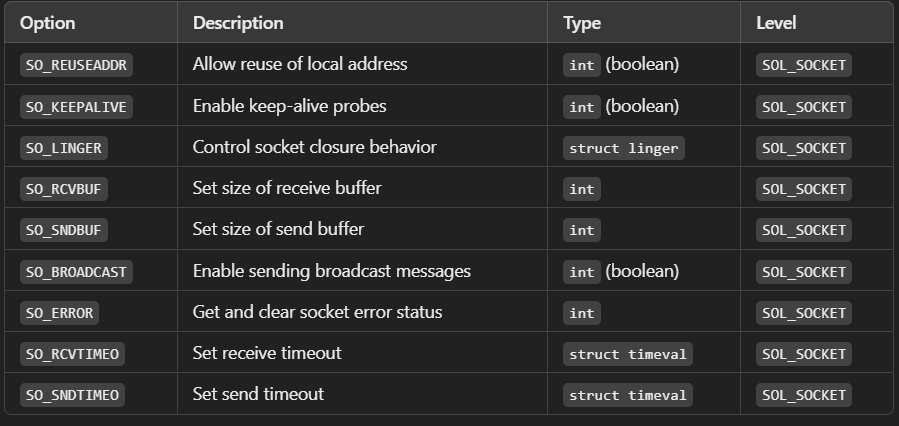
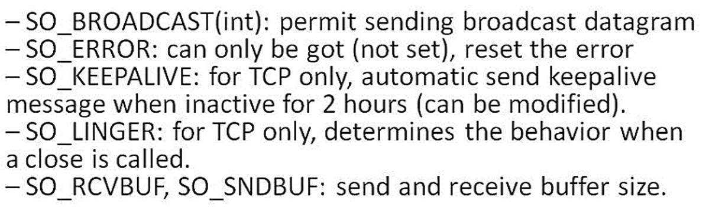

Elementary socket options in Unix networking allow developers to configure socket behavior and retrieve information about a socket. These options are managed using the `setsockopt()` and `getsockopt()` system calls.

## Key Functions for Socket Options

### `setsockopt()`

Used to set a socket option.

**Prototype:**
```c
int setsockopt(int sockfd, int level, int optname, const void *optval, socklen_t optlen);
```

**Parameters:**
- `sockfd`: The socket descriptor.
- `level`: Protocol level at which the option resides (e.g., `SOL_SOCKET` for socket-level options, `IPPROTO_TCP`, `IPPROTO_UDP`, etc.).
- `optname`: The specific option name (e.g., `SO_REUSEADDR`).
- `optval`: A pointer to the option value.
- `optlen`: The size of the `optval` value.

### `getsockopt()`

Used to retrieve the current value of a socket option.

**Prototype:**
```c
int getsockopt(int sockfd, int level, int optname, void *optval, socklen_t *optlen);
```

**Parameters:**
Same as `setsockopt()`, but `optval` and `optlen` are used to store the retrieved value.

## Common Socket Options (Elementary Options)

1. **`SO_REUSEADDR`**
    - **Description:** Allows the socket to bind to an address that is already in use (useful for servers restarting quickly).
    - **Level:** `SOL_SOCKET`
    - **Type:** Boolean (`int`)
    - **Example:**
      ```c
      int opt = 1;
      setsockopt(sockfd, SOL_SOCKET, SO_REUSEADDR, &opt, sizeof(opt));
      ```

2. **`SO_KEEPALIVE`**
    - **Description:** Enables periodic probes to check if the connection is still alive.
    - **Level:** `SOL_SOCKET`
    - **Type:** Boolean (`int`)
    - **Example:**
      ```c
      int opt = 1;
      setsockopt(sockfd, SOL_SOCKET, SO_KEEPALIVE, &opt, sizeof(opt));
      ```

3. **`SO_LINGER`**
    - **Description:** Controls the behavior when a socket is closed with unsent data: Immediate close or wait for unsent data to be sent.
    - **Level:** `SOL_SOCKET`
    - **Type:** `struct linger`
    - **Structure:**
      ```c
      struct linger {
            int l_onoff;  // 0 = off, 1 = on
            int l_linger; // Time to linger in seconds
      };
      ```
    - **Example:**
      ```c
      struct linger sl = {1, 10};  // Linger on, wait for 10 seconds
      setsockopt(sockfd, SOL_SOCKET, SO_LINGER, &sl, sizeof(sl));
      ```

4. **`SO_RCVBUF`**
    - **Description:** Sets the size of the receive buffer.
    - **Level:** `SOL_SOCKET`
    - **Type:** Integer (`int`)
    - **Example:**
      ```c
      int buf_size = 8192;
      setsockopt(sockfd, SOL_SOCKET, SO_RCVBUF, &buf_size, sizeof(buf_size));
      ```

5. **`SO_SNDBUF`**
    - **Description:** Sets the size of the send buffer.
    - **Level:** `SOL_SOCKET`
    - **Type:** Integer (`int`)
    - **Example:**
      ```c
      int buf_size = 8192;
      setsockopt(sockfd, SOL_SOCKET, SO_SNDBUF, &buf_size, sizeof(buf_size));
      ```

6. **`SO_BROADCAST`**
    - **Description:** Enables sending of broadcast messages (used for UDP).
    - **Level:** `SOL_SOCKET`
    - **Type:** Boolean (`int`)
    - **Example:**
      ```c
      int opt = 1;
      setsockopt(sockfd, SOL_SOCKET, SO_BROADCAST, &opt, sizeof(opt));
      ```

7. **`SO_ERROR`**
    - **Description:** Retrieves the error status and clears the error.
    - **Level:** `SOL_SOCKET`
    - **Type:** Integer (`int`)
    - **Example:**
      ```c
      int err;
      socklen_t len = sizeof(err);
      getsockopt(sockfd, SOL_SOCKET, SO_ERROR, &err, &len);
      ```

8. **`SO_RCVTIMEO`**
    - **Description:** Sets a timeout for receive operations.
    - **Level:** `SOL_SOCKET`
    - **Type:** `struct timeval`
    - **Structure:**
      ```c
      struct timeval {
            long tv_sec;  // seconds
            long tv_usec; // microseconds
      };
      ```
    - **Example:**
      ```c
      struct timeval timeout = {5, 0};  // 5 seconds
      setsockopt(sockfd, SOL_SOCKET, SO_RCVTIMEO, &timeout, sizeof(timeout));
      ```

9. **`SO_SNDTIMEO`**
    - **Description:** Sets a timeout for send operations.
    - **Level:** `SOL_SOCKET`
    - **Type:** `struct timeval`
    - **Example:**
      ```c
      struct timeval timeout = {5, 0};  // 5 seconds
      setsockopt(sockfd, SOL_SOCKET, SO_SNDTIMEO, &timeout, sizeof(timeout));
      ```

      
<br>
<br>

      